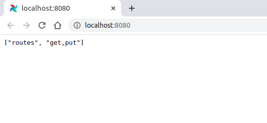
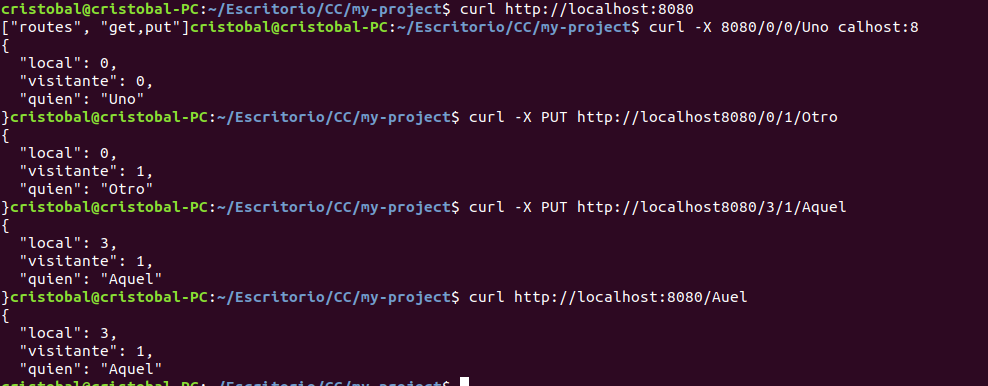
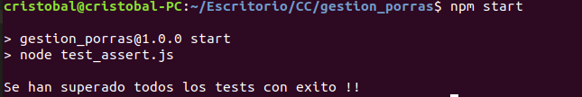
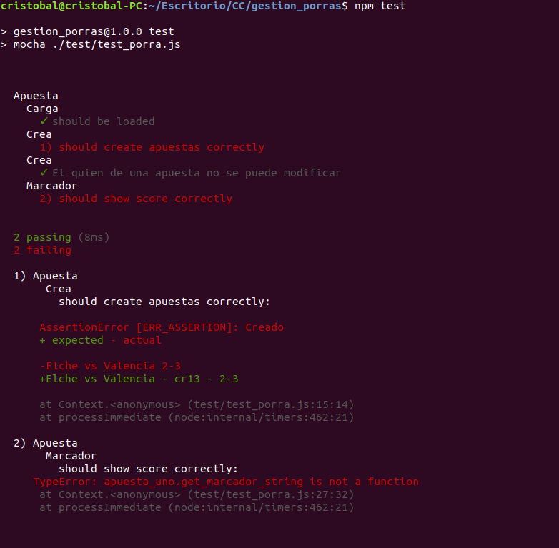
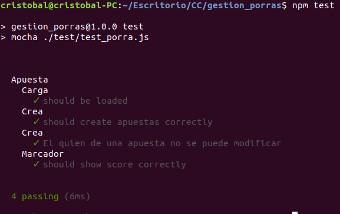
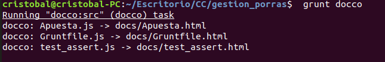

# Tema 2: Desarrollo basado en pruebas

### Ejercicio 1. Instalar alguno de los entornos virtuales de node.js (o de cualquier otro lenguaje con el que se esté familiarizado) y, con ellos, instalar la última versión existente, la versión minor más actual de la 4.x y lo mismo para la 0.11 o alguna impar (de desarrollo).

Se va usar nvm para el uso de distintas versiones de node. Se va a seguir los pasos indicados en su guía [repo](https://github.com/nvm-sh/nvm).

```bash
# Descargamos y ejecutamos el script de instalación

curl -o- https://raw.githubusercontent.com/nvm-sh/nvm/v0.36.0/install.sh | bash

```

Para consultar todas las versiones disponibles de node podemos usar el siguiente comando

```bash
nvm ls-remote
```

Una vez terminado de ejecutar el script ya estaria instalada la herramienta. Por defecto, usa la versión que está instalada en el sistema, aqui vamos a instalar la última version disponnible que es la 15.0.1 (a fecha 25-10-20)

```bash
# Este comando instala la última versión disponible de node
nvm install node 

```

Ahora se va a instalar la última versión minor de 4.x o la 0.11 especificando en el comando anterior la versión deseada.

```bash
nvm install 4.9.1
nvm install 0.11.16
```


Algunos comandos necesarios:

```bash
#Listar versiones instaladas
nvm ls

# Seleccioanr una versión u otra (sin signos <>)
nvm use <version>

# Ejecutar un programa usando una versión concreta (sin signos <>)
nvm run <version> <app.js>


# Para desactivar la version seleccionada por defecto en la terminal actual

nvm deactivate

```

### Ejercicio 2. Crear una descripción del módulo usando package.json. En caso de que se trate de otro lenguaje, usar el método correspondiente.

Ejecutamos  el siguiente comando para  generar el fichero package.json

```bash
npm init
```


Normalmente al instalar una depedencia se guarda automaticamente en el fichero package.json, en caso de que no se guarde podemos forzarlo con el siguiente comando.

```bash
npm install <modulo> --save-dev
# Ejemplo
npm install bootstrap --save-dev

```

### Ejercicio 3. Descargar el [repositorio](https://github.com/JJ/spray-test) de ejemplo anterior, instalar las herramientas necesarias (principalmente Scala y sbt) y ejecutar el ejemplo desde sbt. Alternativamente, buscar otros marcos para REST en Scala tales como Finatra o Scalatra y probar los ejemplos que se incluyan en el repositorio.

Para poder ejecutar el ejemplo, primero debemos instalar Scala y sbt, y para ello, se va a necesitar la versión 8 de Java. 

```bash
# Se actualiza la lista de paquetes disponibles 
sudo apt update
# Instalamos el jdk de java 8
sudo apt install openjdk-8-jdk

```

Una vez que instalamos el jdk de java, instalamos Scala y sbt.

```bash
wget http://scala-lang.org/files/archive/scala-2.12.1.deb
sudo dpkg -i scala*.deb
sudo apt update
sudo apt install scala
```
Instalamos sbt.

```bash
echo "deb https://dl.bintray.com/sbt/debian /" | sudo tee -a /etc/apt/sources.list.d/sbt.list
sudo apt-key adv --keyserver hkp://keyserver.ubuntu.com:80 --recv 2EE0EA64E40A89B84B2DF73499E82A75642AC823
sudo apt update
sudo apt install sbt
```


Una vez instaladas las herramientas necesarias para realizar el test, clonamos, compilamos y ejecutamos el código de la aplicación spray-test. Seguimos los pasos indicados en el [repositorio](https://github.com/JJ/spray-test).

Comprobamos el funcionamiento correcto accediendo desde el navegador a http://localhost:8080



Ejecuta una serie de pruebas desde consola:



### Ejercicio 4. Para la aplicación que se está haciendo, escribir una serie de aserciones y probar que efectivamente no fallan. Añadir tests para una nueva funcionalidad, probar que falla y escribir el código para que no lo haga. A continuación, ejecutarlos desde mocha (u otro módulo de test de alto nivel), usando descripciones del test y del grupo de test de forma correcta. Si hasta ahora no has subido el código que has venido realizando a GitHub, es el momento de hacerlo, porque lo vamos a necesitar un poco más adelante.

Siguiendo la aplicación de gestión de porras descrito en el temario, se ha creado una [aplicación](https://github.com/cr13/gestion_porras) realizado unas modificaciones para realizar los siguientes test.

#### Primer test con aserciones

Este test consiste en añadir tres apuestas verificando su registro/creación correcta, además, de comprobar que la salida de la función as_string sea correcta, también se va acomprobar que no se repiten.
Luego añadimos una apuesta repetida y comprobamos que son iguales.



#### Segundo test con mocha

Se añaden dos funciones nuevas, un función para obtener el código del quien y otra función para obtener en formato string el marcador del evento.

En la primera prueba al pasar el test, obtuvimos los siguientes errores



Si nos fijamos solol pasa 2 test de 4, ha fallado al crear la apuesta y al mostrar el marcador. También podemos ver que el primer fallo es por error de sintasix y el segundo error porque se ha declarado con otro nombre la función por lo tanto no existe. 

Una vez arreglados los fallos, volvemos a ejecutar.



Ahora si ha pasado todos los test correctament.


#### Se genera la documentación




### Ejercicio 5. Haced los dos primeros pasos antes de pasar al tercero.

#### Pasos 
#### 1º Darse de alta. Muchos están conectados con GitHub por lo que puedes usar directamente el usuario ahí. A través de un proceso de autorización, acceder al contenido e incluso informar del resultado de los tests.

#### 2º  Activar el repositorio en el que se vaya a aplicar la integración continua. Travis permite hacerlo directamente desde tu configuración; en otros se dan de alta desde la web de GitHub.


#### 3º  Crear un fichero de configuración para que se ejecute la integración y añadirlo al repositorio.

En el siguiente enlace podeis acceder al archivo de configuración creado [Archivo travis.yml](https://github.com/cr13/gestion_porras/blob/main/.travis.yml)

A continuación se muestra la ejecución del test pasado con exito.


