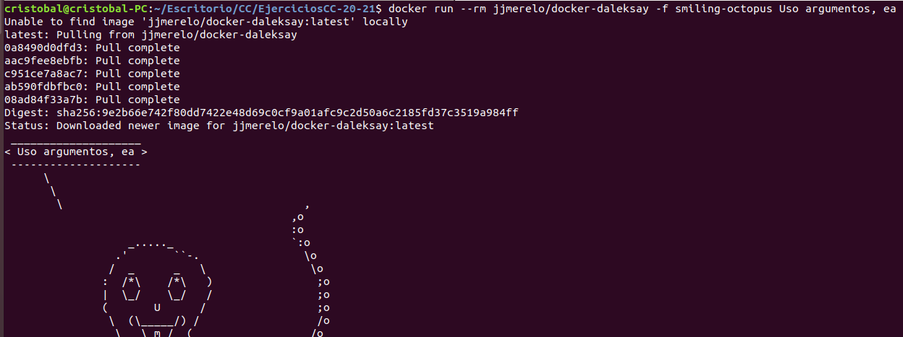
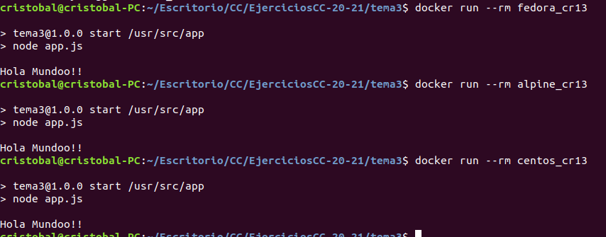
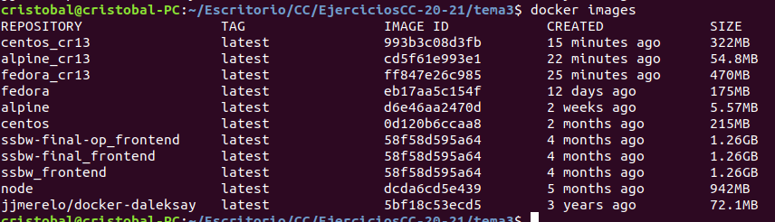
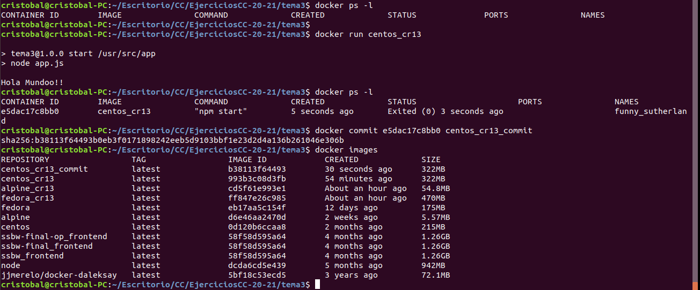
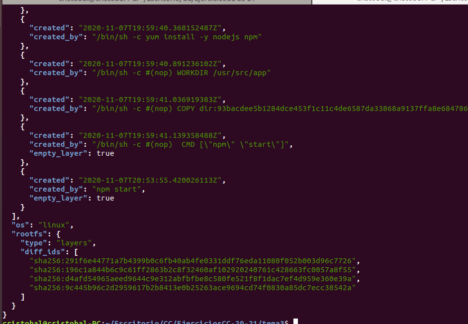
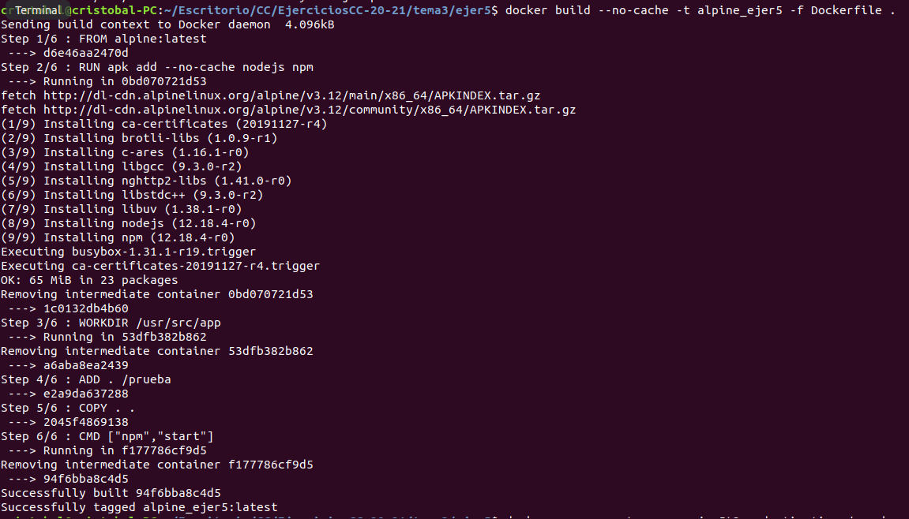
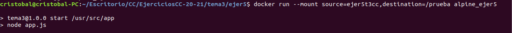

# Tema 3: [Contenedores y cómo usarlos](http://jj.github.io/CC/documentos/temas/Contenedores)

### Ejercicio 1. Buscar alguna demo interesante de Docker y ejecutarla localmente, o en su defecto, ejecutar la imagen anterior y ver cómo funciona y los procesos que se llevan a cabo la primera vez que se ejecuta y las siguientes ocasiones.

Para la realización de este ejercicio se va a utilizar la imagen [daleksay](https://hub.docker.com/r/jjmerelo/docker-daleksay/) vista anteriormente en los apuntes. 

Si ejecutamos la imagen pasandole como argumentos **-f smiling-octopus Uso argumentos, ea** , se consigue que el contenedor actúe como el propio programa al que aísla.

```bash
docker run --rm jjmerelo/docker-daleksay -f smiling-octopus Uso argumentos, ea
```



Como se puede observar en la siguiente captura la primera vez que se ejecuta, comprueba si existe en el sistema de no existir se descarga la ultima versión existente. Y como resultado se ve el pulpo con un mensajito.

Si se vulve a ejecutar como ya existe la imagen simplemente se ejecuta y se muestra al pulpo con su mensajito.


### Ejercicio 2. Tomar algún programa simple, “Hola mundo” impreso desde el intérprete de línea de órdenes, y comparar el tamaño de las imágenes de diferentes sistemas operativos base, Fedora, CentOS y Alpine, por ejemplo.

[Aquí](./tema3/app.js) se puede consultar el programa simple desarrollado en NodeJS.

Una vez creada la aplicación se va a crear un fichero [Dockerfile](./tema3/Dockerfile) con las diferentes imagenes a probar. En cada ejecución hay que descomentar las lineas "FROM" de instalación correspontiente a la imagen que vamos a instalar y la instalación de nodejs y npm que empiezan por "RUN". Sin olvidar comentar las demás.

```bash
 
 #Descomentar las lineas para instalar fedora, comentar las demás imagenes
 docker build --no-cache -t fedora_cr13 -f Dockerfile .

 #Descomenrtar las lineas para alpine, comentar las demás imagenes
 docker build --no-cache -t alpine_cr13 -f Dockerfile .

 # Decomentar las lineas para centos, comentar las demás imagenes
 docker build --no-cache -t centos_cr13 -f Dockerfile .

 ```

Para su ejecucion se va utilizar **docker run** con el el parametro **--rm**  para cuando termine de ejecutarse, borre todo lo relacionado con él y ahorre espacio en el disco.

```bash

docker run --rm fedora_cr13

docker run --rm alpine_cr13

docker run --rm centos_cr13

```



Mostramos la imagenes para poder comprobar lo que ocupa en disco.

```bash

docker images

```



Como podemos comprobar la imagen que menos ocupa es alpine con un tamaño de 54.8MB seguido de centos con 322MB y por ultimo fedora con 470MB.

Dejo [información adicional](https://www.digitalocean.com/community/tutorials/how-to-remove-docker-images-containers-and-volumes-es) para eliminar imagenes, conetendores o volumenes.

### Ejercicio 3. Crear a partir del contenedor anterior una imagen persistente con commit.

Para la realización de este ejercicio se va utilizar el siguiente comando:

```bash

docker commit <CONTAINER_ID> <nombre_image_persistente>

```
Comandos utilizados:

```bash
docker ps -ls

docker run centos_cr13 # Opcional solo en caso de no tener ningun contenedor en ejecución.

docker ps -ls

docker commit e5dac17c8bb0 centos_cr13_commit

docker images

```


### Ejercicio 4. Examinar la estructura de capas que se forma al crear imágenes nuevas a partir de contenedores que se hayan estado ejecutando.

Para la realización de este ejercicio vamos a necesitar instalar la herramienta jq.

```bash
 sudo apt  install jq
```

A continuación localizamos el SHA devuelto al crear la imagen persistente anterior y ejecutamos el siguiente comando:


```bash

sudo cat /var/lib/docker/image/overlay2/imagedb/content/sha256/b38113f64493b0eb3f0171898242eeb5d9103bbf1e23d2d4a136b261046e306b | jq .

```

El resultado de la ejecución es bastante largo por lo que en la imagen siguiente solo se mostrara el final, ya que es donde se encuentra el elemento **diff_ids** que contiene las capas que contiene la imagen.




### Ejercicio 5. Crear un volumen y usarlo, por ejemplo, para escribir la salida de un programa determinado.

Creamos un pequeño programa para escribir en un fichero y nos creamos un nuevo Dockerfile. [VER](./tema3/ejer5/)

```bash
#Se crea un nuevo volumen
docker volume create ejer5t3cc
#Comprobamos que se ha creado con exito
docker volume list
#Se crea la imagen alpine con la aplicacion creada
docker build --no-cache -t alpine_ejer5 -f Dockerfile .
#se ejecuta la imagen en el volumen especificado
docker run --mount source=ejer5t3cc,destination=/prueba alpine_ejer5

```


### Ejercicio 6. Usar un miniframework REST para crear un servicio web y introducirlo en un contenedor, y componerlo con un cliente REST que sea el que finalmente se ejecuta y sirve como “frontend”.

### Ejercicio 7. Reproducir los contenedores creados anteriormente usando un Dockerfile

Esto se ha realizado en el ejericio 5


### Ejercicio 8. Crear con docker-machine una máquina virtual local que permita desplegar contenedores y ejecutar en él contenedores creados con antelación.

Para este ejercicio se ha tenido que instalar [docker-machine](https://docs.docker.com/engine/install/ubuntu/) en ubuntu, además de instalar los controladores de virtualbox en caso de no tener instalado virtualbox.

Una vez instalado procedemos a crear nuestra maquina virtual :

```bash

docker-machine create --driver virtualbox=maqVirtDocker

docker-machine ls

docker-machine env maqVirtDocker

eval $(docker-machine env maqVirtDocker)

docker run -d -p 80:3000 webappproject/user-service python app.py
```