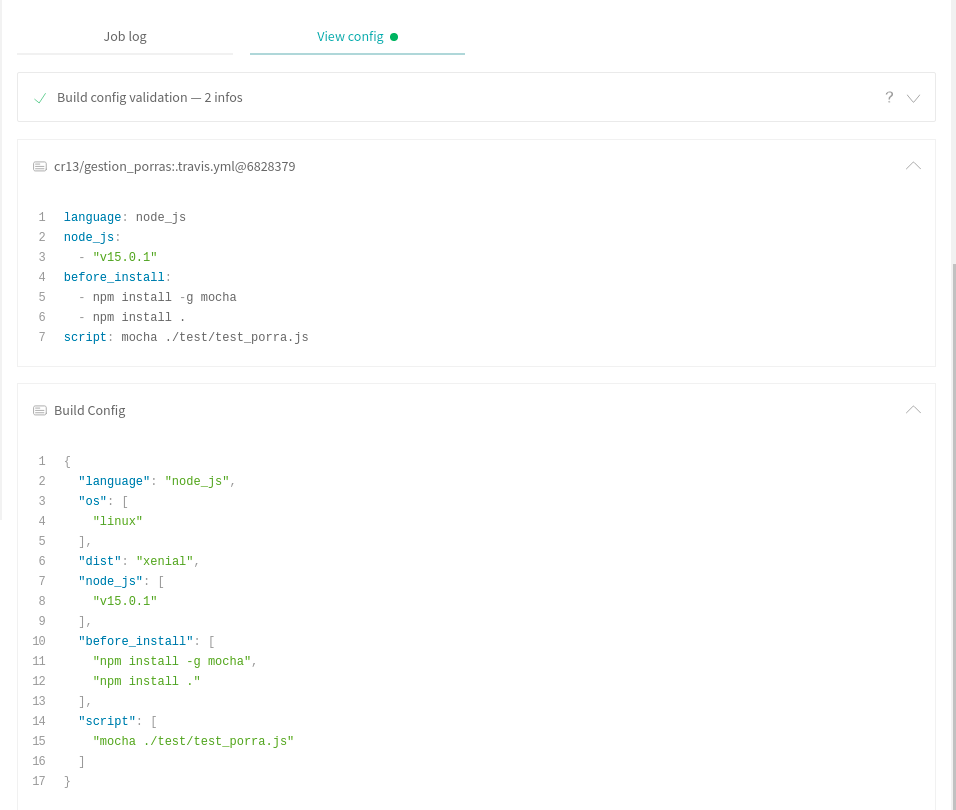
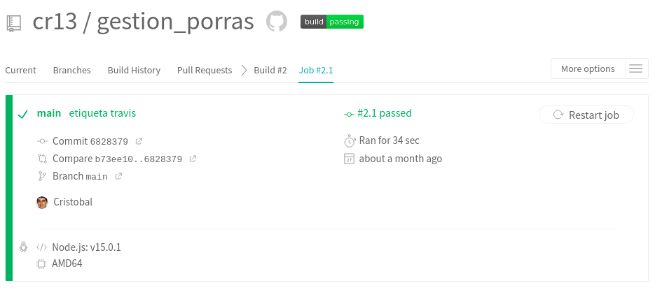
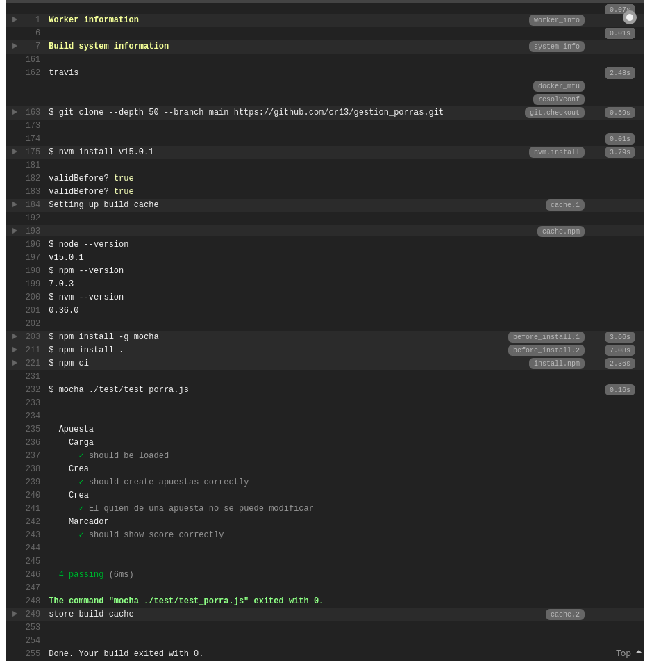
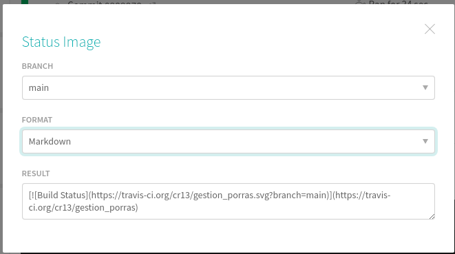
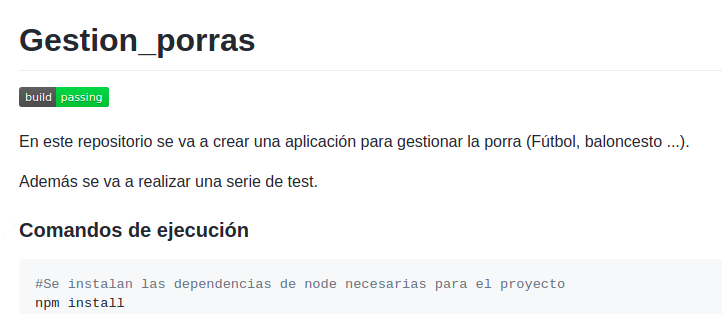

### Ejercicio 1. Haced los dos primeros pasos antes de pasar al tercero.

#### Pasos 
#### 1º Darse de alta. Muchos están conectados con GitHub por lo que puedes usar directamente el usuario ahí. A través de un proceso de autorización, acceder al contenido e incluso informar del resultado de los tests.

#### 2º  Activar el repositorio en el que se vaya a aplicar la integración continua. Travis permite hacerlo directamente desde tu configuración; en otros se dan de alta desde la web de GitHub.


#### 3º  Crear un fichero de configuración para que se ejecute la integración y añadirlo al repositorio.

En el siguiente enlace podeis acceder al archivo de configuración creado [Archivo travis.yml](https://github.com/cr13/gestion_porras/blob/main/.travis.yml)



### Ejercicio 2: Configurar integración continua para nuestra aplicación usando Travis o algún otro sitio.

<a name="Estado_de_travis"></a>
En el ejercicio anterior se ha creado y configurado el archivo de configuración. Como muestra de ello se puede ver el estado actual de lso test realizados al proyecto.



Ejecución del test pasado con exito.



También se puede añadir una etiqueta en el README del proyecto para de un simple vistazo saber si ha fallado o ha pasado con exito los test realizados a través de travis. Y en caso de fallo poder pinchar y te lleva a travis para ver el log.

Para obtener el enlace de la etiqueta solo debemos pulsar en la etiqueta **build/passing** que aparece en el [estado del proyecto en travis](#Estado_de_travis) y seleccionamos el formato que queramos, en nuestro caso Markdown.




```bash
# Linea que hay que añadir al readme
[](https://travis-ci.org/cr13/gestion_porras)

```

Resultado de etiqueta en README:


