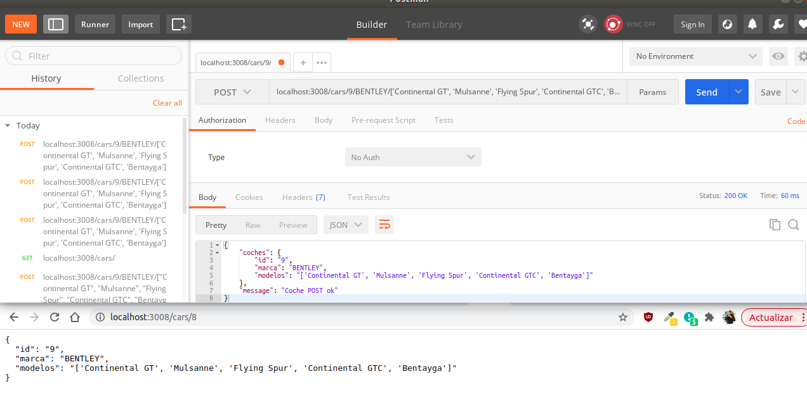
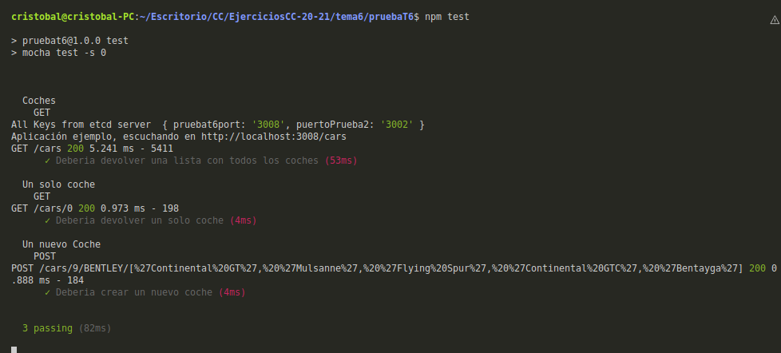

### Ejercicio 1. Instalar [**etcd3**](https://computingforgeeks.com/how-to-install-etcd-on-ubuntu-18-04-ubuntu-16-04/), averiguar qué bibliotecas funcionan bien con el lenguaje que estemos escribiendo el proyecto (u otro lenguaje), y hacer un pequeño ejemplo de almacenamiento y recuperación de una clave; hacer el almacenamiento desde la línea de órdenes (con **etcdctl**) y la recuperación desde el mini-programa que hagáis.

Una vez instalado podemos verificar con:

```bash

# Checkeamos el estado del servicio
sudo systemctl  status etcd.service

# El servicio se lanza en el puerto 2379 de localhost
ss -tunelp | grep 2379

etcdctl member list

```


No olvidar realizar el export para que funcione correctamente el cliente.

```bash

export ETCDCTL_API=3

```

Para realizar un ejemplo del almacenamiento de una clave valor, vamos a almacenar el puerto donde vamos a ejecutar el servicio. Para ello:

```bash

etcdctl put pruebaT6port 3008


```

Volver a realizar el primer paso.

Aplicación creada en el entorno nodeJS y utilizando el framework express.

```bash

var express = require('express');
var app = express();

const { Etcd3 } = require('etcd3');
const client = new Etcd3();

// const port = 3002

async function showEnvironment() {
    const results = await client.getAll();
    console.log(`All Keys from etcd server `, results);
}

async function getPort() {
    const port = await client.get('pruebat6port');
    return port;
}


let port = process.env.port || 3320;

(async () => {
    await showEnvironment();
    port = await getPort();
})().then(() => {

    app.listen(port, function () {
        console.log(`Aplicación ejemplo, escuchando en http://localhost:${port}`);
    });

})


```


### Ejercicio 2: Realizar una aplicación básica que use algún microframework para devolver alguna estructura de datos del modelo que se viene usando en el curso u otra que se desee. La intención de este ejercicio es simplemente que se vea el funcionamiento básico de un microframework, especialmente si es alguno que, como **express**, tiene un generador de código. Se puede usar, por otro lado, el lenguaje y microframework que se desee.

Para la realización de este ejercicios vamos a continuar con la aplicación creada en el ejercicio anterior.
Lo primero que se ha hecho a sido buscar una estructura de datos, se ha elegido una estructura de marca y modelos de coches que ha sido obtenida de [aquí](https://gist.github.com/AnndresRodriguez/a4216e3f82f45fc4514dc954f967fe9a)

Lo siguiente que vamos a hacer es instalar un Middleware para registrar las solicitudes HTTP ([**Morgan**](https://www.npmjs.com/package/morgan)) y una herramienta para facilitar el desarrollo de la aplicación ([**Nodemon**](https://www.npmjs.com/package/nodemon)).

Una vez instalados modificamos el código, quedando nos el siguiente resultado:

```bash
var express = require('express');
var app = express();
const morgan = require('morgan');
const cars = require('./data/data_coches.json');

const { Etcd3 } = require('etcd3');
const client = new Etcd3();

// Settings
let port = process.env.port || 3320;
app.set('json spaces', 2);


//Middlewares
app.use(morgan('dev'));
app.use(express.urlencoded({ extended: false }));
app.use(express.json());


//Routes
app.get("/cars", (req, res) => {
    res.json(cars);
});


async function showEnvironment() {
    const results = await client.getAll();
    console.log(`All Keys from etcd server `, results);
}

async function getPort() {
    const port = await client.get('pruebat6port');
    return port;
}


(async () => {
    await showEnvironment();
    port = await getPort();
})().then(() => {

    app.listen(port, function () {
        console.log(`Aplicación ejemplo, escuchando en http://localhost:${port}/cars`);
    });

})

```

Para la verificación del funcionamiento correcto del servicio, arrancamos el servicio con **npm start**

Como se puede apreciar vemos en la siguiente captura, gracias al Middlewares Morgan podemos ver las peticiones gets que se realizan:


Comprobación desde el navegador accedemos a http://localhost:3008/cars


O también podemos comprobarlo haciendo una petición get desde postman.


### Ejercicio 3: Programar un microservicio en express (o el lenguaje y marco elegido) que incluya variables como en el caso anterior.

Siguiendo con la aplicación de los ejercicios anteriores, vamos a ampliar el funcionamiento.

Se va ha crear un [fichero](./tema6/pruebaT6/routes/cars.js) para las rutas y se van añadir dos rutas nuevas.

Se ha mantenido la ruta que muestra toda la estructura de datos:

- GET /cars

Las dos nuevas añadidas son:
Utilizando la petición GET  se va a devolver el coche cuyo id pasemos como parámetro. Asegurando nos de que el id exista y sino existe devolvemos un código 404 con un mensaje.

- GET /cars/id

Utilizando una petición POST creamos un nuevo coche cuyos datos se pasaran por parámetro.

- POST /cars/id/marca/[modelos]

Ejemplo de utilización:




### Ejercicio 4: Crear pruebas para las diferentes rutas de la aplicación.

Para la realización de las pruebas se va a utilizar [mocha](https://mochajs.org/) y [supertest](https://www.npmjs.com/package/supertest). Además se va a crear un [fichero](./tema6/pruebaT6/test/test.js) con los siguientes test.

```bash

var request = require("supertest");
app = require("./app.js");


describe("Coches", () => {
    describe("GET", () => {
        it("Deberia devolver una lista con todos los coches", (done) => {
            request(app)
                .get("/cars")
                .expect("Content-Type", /json/)
                .expect(200, done);
        });
    });
});

describe("Un solo coche", () => {
    describe("GET", () => {
        it("Deberia devolver un solo coche", (done) => {
            request(app)
                .get("/cars/0")
                .expect("Content-Type", /json/)
                .expect(200, done);
        });
    });
});

describe("Un nuevo Coche", () => {
    describe("POST", () => {
        it("Deberia crear un nuevo coche", (done) => {
            request(app)
                .post("/cars/9/BENTLEY/['Continental GT', 'Mulsanne', 'Flying Spur', 'Continental GTC', 'Bentayga']")
                .expect("Content-Type", /json/)
                .expect(200, done);
        });
    });
});

```

Para su ejecución:

```bash 

npm test

``` 




### Ejercicio 5: Experimentar con diferentes gestores de procesos y servidores web front-end para un microservicio que se haya hecho con antelación, por ejemplo en la sección anterior.

Los gestores de procesos y servidores web que se van a probar son [**Forever**](https://www.npmjs.com/package/forever) y [**PM2**](https://www.npmjs.com/package/pm2).

Lo primero que debemos hacer es instalar el paquete Forever de forma global.

```bash 
    npm install -g forever
```

Comandos básicos:


```bash 
    # Para inicializar el gestor forever
    forever start ./app.js

    # Para listar los procesos activos
    forever list

    # Para parar todos los procesos 
    forever stopall
```
Si los ejecutamos obtenemos los siguientes resultados:


Ahora vamos a probar **PM2**, el cuál debemos instalar también:

```bash 
    npm install -g pm2
```

Comandos básicos:


```bash 
    # Para inicializar el gestor pm2
    pm2 start ./app.js # El nombre de la instancia sera el nombre de la app
    # ó
    pm2 start ./app.js --name "coches" # Se especifica nombre de la instancia

    # Parar la instancia
    pm2 stop app # En caso de no asignar nombre 
    pm2 stop coches #En caso de haber asignado un nombre

    # Se puede relanzar las instancias existentes
    pm2 reload app

    #Para eliminar una instancias
    pm2 delete app

```

Si los ejecutamos obtenemos los siguientes resultados:


Otros comandos interesantes son:

```bash 
    # Crear varias instancias al inicializar
     pm2 start ./app.js --name "coches" -i 3

    # Mostrar información de las instancias
    pm2 describe coches


```


### Ejercicio 6: Usar **rake**, **invoke** o la herramienta equivalente en tu lenguaje de programación para programar diferentes tareas que se puedan lanzar fácilmente desde la línea de órdenes un microservicio.

Para la realización de este ejercicio se va utilizar el gestor de tareas Grunt visto en el temario.

Para ello vamos a instalarlo y algunos plugins

```bash
    #Instalar paquete grunt
    npm install grunt-cli
 
    #plugins
    npm install grunt-run
    npm install grunt-mocha-test

```

Una vez que tenemos todo instalado creamos el fichero [Gruntfile.js](./tema6/pruebaT6/Gruntfile.js).

En este fichero se van a definir 4 tareas:

1. Para lanzar los test utilizando mocha.
2. Crear una instancia del servicio utilizando PM2. 
3. Parar la instancia creada.
4. Eliminar instancia creada.

Ejemplo de uso:


