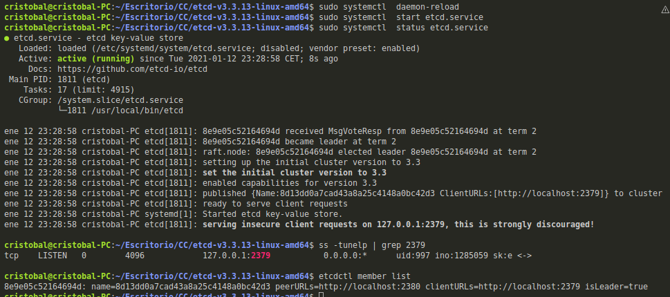

### Ejercicio 1: Crear un pod con dos o más contenedores, de forma que se pueda usar uno desde el otro. Uno de los contenedores contendrá la aplicación que queramos desplegar.

### Ejercicio 2: Usar un miniframework REST para crear un servicio web y introducirlo en un contenedor, y componerlo con un cliente REST que sea el que finalmente se ejecuta y sirve como “frontend”.

