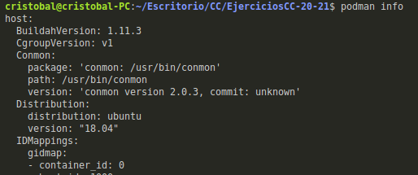
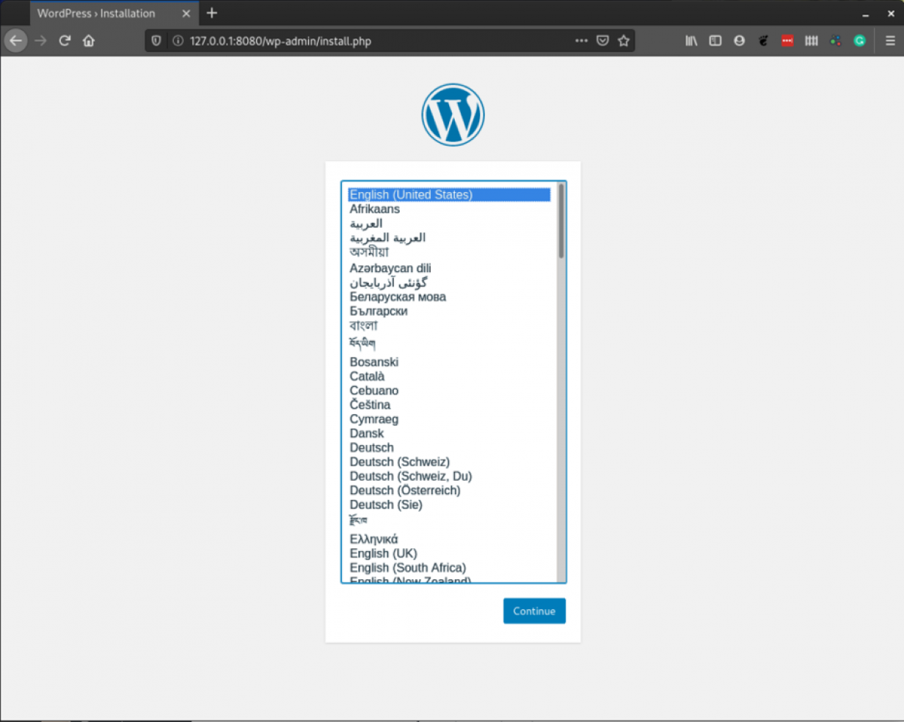

### Ejercicio 1: Crear un pod con dos o más contenedores, de forma que se pueda usar uno desde el otro. Uno de los contenedores contendrá la aplicación que queramos desplegar.

- Instalamos podman como indica en su [documentación](https://podman.io/getting-started/installation). Aunque para la versión 18.04 de ubuntu no se puede instalar porque el repositorio no esta disponible por defecto en esta versión de ubuntu, para agregar el repositorio se ha seguido este [tutorial](https://clouding.io/hc/en-us/articles/360011382320-How-to-Install-and-Use-Podman-on-Ubuntu-18-04).

Pasos seguidos para instalación:

```bash

apt-get update -y

apt-get upgrade -y

# Agregamos el repositorio 

apt-get install software-properties-common -y

add-apt-repository -y ppa:projectatomic/ppa

# Instalamos podman

apt-get install podman -y

# Verificamos instalación con 

podman info

# o comprobando la versión

podman -v

```



Como ejemplo, se va utilizar dos contendores, que va consistir en el despliegue del framework WordPress y su correspondiente base de datos. [Ref utilizada](https://www.redhat.com/sysadmin/compose-podman-pods).


1- Creamos el primer pod y mapeamos los puertos 

```bash

sudo podman pod create --name my-pod -p 8080:80

```
Esto no seria necesario si solo se utiliza un  contenedor, en nuestro caso vamos a utilizar dos, por eso se ha mapeado el puerto.

2- Creamos los contendores, primero se va a crear el contenedor de BD (MariaDB)

```bash

sudo podman run \
-d --restart=always --pod=my-pod \
-e MYSQL_ROOT_PASSWORD="myrootpasspod" \
-e MYSQL_DATABASE="wp" \
-e MYSQL_USER="wordpresspod" \
-e MYSQL_PASSWORD="w0rdpr3sspod" \
--name=wptest-db mariadb

```

3- Creamos el conetendor de con WordPress y lo configuramos para que conecte a la BD creada anteriormente.

```bash
sudo podman run \
-d --restart=always --pod=my-pod \
-e WORDPRESS_DB_NAME="wp" \
-e WORDPRESS_DB_USER="wordpresspod" \
-e WORDPRESS_DB_PASSWORD="w0rdpr3sspod" \
-e WORDPRESS_DB_HOST="127.0.0.1" \
--name wptest-web wordpress

```

Para comprobar el correcto funcionamiento podemos acceder desde el navegador, como se muestra a continuación.



Algunos comandos útiles

```bash
#imagenes descargadas
podman images

# ver contenedores en ejecución
podman ps -a

# arrancar o parar un contenedor

podman stop --latest
podman start --latest

# eliminar un contenedor

podman rm --latest

```


### Ejercicio 2: Usar un miniframework REST para crear un servicio web y introducirlo en un contenedor, y componerlo con un cliente REST que sea el que finalmente se ejecuta y sirve como “frontend”.


